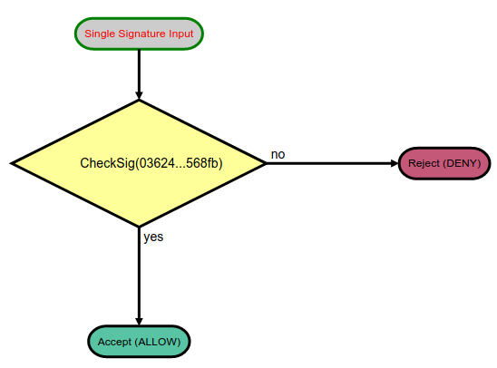

Quick start
=============

Smacco is a tool designed to easily generate "smart accounts" for holding assets.
The specification of a smart account is made on JSON language, and the corresponding C# code
is generated for Neo2 blockchain. 
A visual diagram is also generated, for simplicity.

The tool can be used `online <https://neoresearch.io/smacco>`_, so `installing <../install>`_ 
is not required (only for local testing).

First Example 
-------------

The first Smart Account is a basic *public key verification contract*, which is the simplest
and most widespread mechanism to hold assets on Neo blockchain (and also on Bitcoin).

.. code-block:: json

    {
        "standard": "smacco-1.0",
        "input_type" : "single",
        "pubkey_list" : ["036245f426b4522e8a2901be6ccc1f71e37dc376726cc6665d80c5997e240568fb"],
        "rule" : {
            "rule_type": "ALLOW_IF",
            "condition" : {
            "condition_type" : "CHECKSIG"
            }
        }
    }

And the corresponding C# smart contract:

.. code-block:: csharp

    using Neo.SmartContract.Framework;
    using Neo.SmartContract.Framework.Services.Neo;
    using Neo.SmartContract.Framework.Services.System;
    namespace NeoContract1 {
    public class Contract1 : SmartContract {
        public static readonly byte[] pubkey_0 = "036245f426b4522e8a2901be6ccc1f71e37dc376726cc6665d80c5997e240568fb".HexToBytes();
        public static bool Main(byte[] signature){
            return (VerifySignature(signature, pubkey_0));
        }
    }
    }

.. hint::
    The `online`_ platform already compiles C# code using `NeoCompiler Eco <https://neocompiler.io>`_ infrastructure.
    Platform also generates the following diagram: 
    |contract1|
    

Definition starts with *standard*, and :code:`smacco-1.0` has two :code:`input_type`: single or multi.
We start with *input_type* :code:`single`, which means that a *single signature* is received as input parameter.

The goal of the generated verification contract is to return a :code:`boolean` (*true/false*) response, 
when a single signature is provided.

We then explore :code:`rule` section.

Understanding Rules
*******************

Every smart account is composed by one or more *rules*, that govern the behavior of the contract.
Smacco provides two fields: 

- :code:`rule`: when a single rule is used (the simplest form)
- :code:`rules`: when multiple rules are used

Each *rule* is divided in three parts: *rule_type*, *condition_type* and *condition*.

