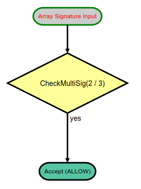
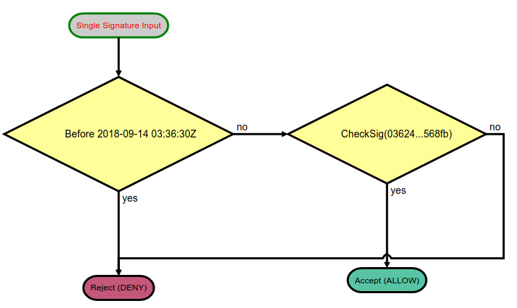

Quick start
=============

Smacco is a tool designed to easily generate "smart accounts" for holding assets.
The specification of a smart account is made on JSON language, and the corresponding C# code
is generated for Neo2 blockchain. 
A visual diagram is also generated, for simplicity.

The tool can be used `online <https://neoresearch.io/smacco>`_, so `installing <../install>`_ 
is not required (only for local testing).

First Example 
-------------

The first Smart Account is a basic *public key verification contract*, which is the simplest
and most widespread mechanism to hold assets on Neo blockchain (and also on Bitcoin).

.. code-block:: json

    {
        "standard": "smacco-1.0",
        "input_type" : "single",
        "pubkey_list" : ["036245f426b4522e8a2901be6ccc1f71e37dc376726cc6665d80c5997e240568fb"],
        "rule" : {
            "rule_type": "ALLOW_IF",
            "condition" : {
                "condition_type" : "CHECKSIG"
            }
        }
    }

And the corresponding C# smart contract:

.. code-block:: csharp

    using Neo.SmartContract.Framework;
    using Neo.SmartContract.Framework.Services.Neo;
    using Neo.SmartContract.Framework.Services.System;
    namespace NeoContract1 {
    public class Contract1 : SmartContract {
        public static readonly byte[] pubkey_0 = "036245f426b4522e8a2901be6ccc1f71e37dc376726cc6665d80c5997e240568fb".HexToBytes();
        public static bool Main(byte[] signature){
            return (VerifySignature(signature, pubkey_0));
        }
    }
    }

.. |contract1| image:: _static/_figs/contract1.png
   :width: 300
   :alt: First contract

.. hint::
    The `online`_ platform already compiles C# code using `NeoCompiler Eco <https://neocompiler.io>`_ infrastructure.
    Platform also generates the following diagram: 
    |contract1|
    

Definition starts with *standard*, and :code:`smacco-1.0` has two :code:`input_type`: single or multi.
We start with *input_type* :code:`single`, which means that a *single signature* is received as input parameter.
The field :code:`pubkey_list` declares the used keys for public key criptography.

.. note::
    Neo uses *NIST P-256 secp256r1* elliptic curve cryptography.
    See project `libcrypton <http://github.com/neoresearch/libcrypton>`_ for more information.

The goal of the generated verification contract is to return a :code:`boolean` (*true/false*) response, 
when a matching signature is provided.

We then explore :code:`rule` section.

Understanding Rules
-------------------

Every smart account is composed by *one or more rules*, that govern the behavior of the contract.
Smacco provides two fields: 

- :code:`rule`: when a single rule is used (the simplest form)
- :code:`rules`: when multiple rules are used

Each *rule* is divided in two parts: *rule_type* and *condition*.

A :code:`rule_type` can be: 

- :code:`ALLOW_IF`: directly **accepts** operation (returns *true*) if *condition* is **satisfied**
- :code:`DENY_IF`: directly **rejects** operation (returns *false*) if *condition* is **not satisfied**

Every :code:`condition` has a *condition_type* in many formats, including:

- :code:`CHECKSIG`: checks a single signature parameter against public key 
- :code:`CHECKMULTISIG`: checks an array of signatures as parameter against an array of public keys
- and many others... *note that details are not given at this point, let's move on*

Default Rule and Inlining
*************************

It's important to highlight that a :code:`default_rule` governs the corner cases of the contract, and can be:

- :code:`DENY_ALL`: standard option, if no rule explicitly accepts, then operation is rejected
- :code:`ACCEPTS_ALL`: if no rule explicitly rejects, then operation is accepted

.. important::
    Note that *default_rule* is only used when :code:`"inline_last"="disabled"`. Since inlining
    is enabled by default, we typically don't use a :code:`default_rule`.

MultiSig Example 
----------------

Next example validates a subset of public keys against an array of signatures passed as parameter, known as *multisig*.
This account type is generally used to provide extra security, in two common scenarios:

- requiring multiple entities to attach signatures, e.g., a 3/3 multisig (only valid if three-out-of-three sign together)
- accepting fallback signatures, if some of them is lost, e.g., a 2/3 multisig (valid if any two-out-of-three sign together)

We provide an example of 2/3 multisig, with *default_rule* set to :code:`DENY_ALL` (disabling inlining):

.. code-block:: json

    {
        "standard": "smacco-1.0",
        "input_type": "array",
        "pubkey_list": [
            "036245f426b4522e8a2901be6ccc1f71e37dc376726cc6665d80c5997e240568fb",
            "0303897394935bb5418b1c1c4cf35513e276c6bd313ddd1330f113ec3dc34fbd0d",
            "02e2baf21e36df2007189d05b9e682f4192a101dcdf07eed7d6313625a930874b4"
        ],
        "rule": {
            "rule_type": "ALLOW_IF",
            "condition": {
            "condition_type": "CHECKMULTISIG",
            "minimum_required": "2"
            }
        },
        "default_rule" : "DENY_ALL"
    }
                                                

And the corresponding C# smart contract:

.. code-block:: csharp

    using Neo.SmartContract.Framework;
    using Neo.SmartContract.Framework.Services.Neo;
    using Neo.SmartContract.Framework.Services.System;
    namespace NeoContract1 {
    public class Contract1 : SmartContract {
        public static readonly byte[] pubkey_0 = "036245f426b4522e8a2901be6ccc1f71e37dc376726cc6665d80c5997e240568fb".HexToBytes();
        public static readonly byte[] pubkey_1 = "0303897394935bb5418b1c1c4cf35513e276c6bd313ddd1330f113ec3dc34fbd0d".HexToBytes();
        public static readonly byte[] pubkey_2 = "02e2baf21e36df2007189d05b9e682f4192a101dcdf07eed7d6313625a930874b4".HexToBytes();
        public static bool CheckMultiSig2_3(byte[][] signatures){
            byte[][] vpub = new[] {pubkey_0, pubkey_1, pubkey_2};
            byte[][] vsig = new[] {signatures[0], signatures[1]};
            return VerifySignatures(vsig, vpub);
        }
        public static bool Main(byte[][] signatures) {
            if(CheckMultiSig2_3(signatures))
                return true;
            return false;
        }
    }
    }

.. hint::
    The `online`_ platform already compiles C# code using `NeoCompiler Eco <https://neocompiler.io>`_ infrastructure.
    Platform also generates the following diagram: 
    |contract2|
    

Timelock Contract 
-----------------

One of the most powerful capability of Smacco is to easily generate *timelock accounts*.
Many blockchain projects rely on time locks to enforce token governance, 
disabling any possible operation *before* or *after* a given time.

We provide an example of a timelock *until timestamp* **1536896190** (*09/14/2018 @ 3:36am UTC*):

.. code-block:: json

    {
        "standard": "smacco-1.0",
        "input_type": "single",
        "pubkey_list": [
            "036245f426b4522e8a2901be6ccc1f71e37dc376726cc6665d80c5997e240568fb"
        ],
        "rules": [
            {
                "rule_type": "DENY_IF",
                "condition": {
                    "condition_type": "TIMESTAMP_LESS",
                    "timestamp": "1536896190"
                }
            },
            {
                "rule_type": "ALLOW_IF",
                "condition": {
                    "condition_type": "CHECKSIG"
                }
            }
        ]
    }

                                                

And the corresponding C# smart contract:

.. code-block:: csharp

    using Neo.SmartContract.Framework;
    using Neo.SmartContract.Framework.Services.Neo;
    using Neo.SmartContract.Framework.Services.System;
    namespace NeoContract1 {
    public class Contract1 : SmartContract {
        public static readonly byte[] pubkey_0 = "036245f426b4522e8a2901be6ccc1f71e37dc376726cc6665d80c5997e240568fb".HexToBytes();
        public static bool Main(byte[] signature) {
            if(Blockchain.GetHeader(Blockchain.GetHeight()).Timestamp < 1536896190)
                return false;
            return (VerifySignature(signature, pubkey_0));
        }
    }
    }

.. hint::
    The `online`_ platform already compiles C# code using `NeoCompiler Eco <https://neocompiler.io>`_ infrastructure.
    Platform also generates the following diagram: 
    |contract3|

